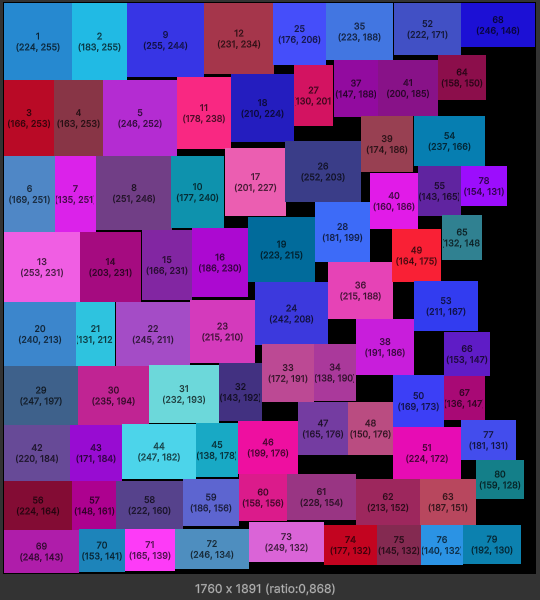

# Atlas Packer

> Its beta version of internal tool. No guarantees use at your own risk

Atlas Packer its simple tool for pack regions to atlases



## Features

- Support max atlas size and padding
- Generate several atlases when regions cant be packed in one
- Not stop packing if some regions cant be packed
- Work only with Vector2Int and RectInt data
- Try create more "square" atlases, but not create POT atlases
- Its not thread safe but you can use it in not main Unity thread

## Instalation

You can use this tool as package via git link git@github.com:NeonTanto/atlas-packer.git or https://github.com/NeonTanto/atlas-packer.git. About installation packages from git you can read in this [manual](https://docs.unity3d.com/Manual/upm-ui-giturl.html)

## Basic usage

### Manual packing:

You can pack your rects one by one or with bulk operation. This methods can be combined

```cs
var packer = new AtlasPacker(padding: 4, maxSize: 2048);

packer.AddRect(size: new Vector2Int(100, 200), id: 1);
packer.AddRect(size: new Vector2Int(200, 100), id: 2);

var packedData = packer.PackData;

packer.Reset();
```

```cs
var packer = new AtlasPacker(padding: 4, maxSize: 2048);

var rects = new AtlasRect[]
{
    new AtlasRect {id = 1, bounds = new RectInt(Vector2Int.zero, new Vector2Int(100, 200))},
    new AtlasRect {id = 2, bounds = new RectInt(Vector2Int.zero, new Vector2Int(200, 100))}
};

this.packer.AddRects(rects);
var packedData = packer.PackData;

packer.Reset();
```

The Reset method will drop the internal state and breaks the connection with the previously received PackData

### Auto packing:

When you work with manual methods you need choose order of rects by self. For "auto" approach we have two extention methods:

```cs
packer.PackRects(rects, RectOrder.HeightThenWidth);
packer.PackRectsWithBestOrder(rects, out RectOrder choosedOrder);
```

Both methods reset packer before and after execution. Second method try pack rects with all methods and choose best by pack ratio. Pack ratio calculated as `var ratio = sumRectArea / atlasArea`
